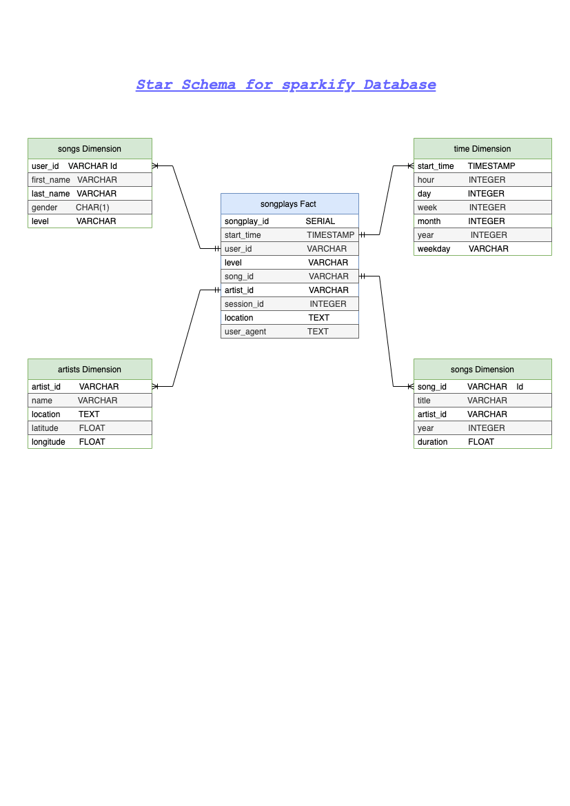

<br />
<p align="center">
  
 <h3 align="center">Data Modeling ETL with PostgreSQL</h3>
 <p align="center">
  Udacity Nanodegree Project 1
  <br />
 </p>
</p>

## About The Project

A startup called Sparkify wants to analyze the data they've been collecting on songs and user activity on their new music streaming application. The analytics team is particularly interested in understanding what songs users are listening to. Currently, they don't have an easy way to query their data, which resides in a directory of JSON logs on user activity on the application, as well as a directory with JSON meta-data on the songs in their application.

They'd like a data engineer to create a Postgres database with tables designed to optimize queries on song play analysis. In this project we will create a database schema and ETL pipeline for this analysis. and also test the database and ETL pipeline by running queries given to us by the analytics team from Sparkify and compare our results with their expected results.

### Project Description

In this project, we will model the data with Postgres and build an ETL pipeline using Python. The fact and dimension tables for a star database schema for a particular analytic focus is defined, and an ETL pipeline that transfers data from files in two local directories into these tables in Postgres using Python and SQL was developed.

### Used Technologies

* python(including pandas, psycopg2, os, glob  libraries)
* PostgreSQL Database 
* Jupyter Notebook

### Data
- **Song datasets**: all json files are nested in subdirectories under */data/song_data*. A sample of this files is:

```
{"num_songs": 1, "artist_id": "ARJIE2Y1187B994AB7", "artist_latitude": null, "artist_longitude": null, "artist_location": "", "artist_name": "Line Renaud", "song_id": "SOUPIRU12A6D4FA1E1", "title": "Der Kleine Dompfaff", "duration": 152.92036, "year": 0}
```

- **Log datasets**: all json files are nested in subdirectories under */data/log_data*. A sample of a single row of each files is:

```
{"artist":"Slipknot","auth":"Logged In","firstName":"Aiden","gender":"M","itemInSession":0,"lastName":"Ramirez","length":192.57424,"level":"paid","location":"New York-Newark-Jersey City, NY-NJ-PA","method":"PUT","page":"NextSong","registration":1540283578796.0,"sessionId":19,"song":"Opium Of The People (Album Version)","status":200,"ts":1541639510796,"userAgent":"\"Mozilla\/5.0 (Windows NT 6.1) AppleWebKit\/537.36 (KHTML, like Gecko) Chrome\/36.0.1985.143 Safari\/537.36\"","userId":"20"}
```

### Database Schema



For this project we used a Star Schema with one main Fact table containing all the measures associated to each event(user actions), and 4 Dimensions tables, each one with a primary Key that is being referenced from the Fact table.

#### Whe using a Star Schema Model ?

- Making queries easier with simple JOINS.
- The amount of data to analyze is not big enough to require a big data solution or using NoSQL Databases.

### Files used in the repository

1. **data** folder nested at the home of the project, where all needed jsons files reside.
2. **sql_queries.py** contains all your sql queries, and is imported into the files bellow.
3. **create_tables.py** drops and creates tables. You run this file to reset your tables before each time you run your ETL scripts.
4. **test.ipynb** displays the first few rows of each table to let you check your database.
5. **etl.ipynb** reads and processes a single file from song_data and log_data and loads the data into your tables. 
6. **etl.py** reads and processes files from song_data and log_data and loads them into your tables. 
7. **Consulting_Data.ipynb** Showing 2 examples of the data(song_data, log_data) before starting the project
7. **README.md** provides discussion on my project.

### How to run the Python scripts:

#### Prerequisites
- Python installed
- PostgreSQL installed 
- psycopg2 and pandas libraries

#### How to run
1. Navigate to `Project 1 Data Modeling with PostgreSQL`
2. Run `create_tables.py`to create and reset the tables using this command

   ```python
   python create_tables.py
   ```
3. Run ETL process and load data into the database using

   ```python
   python etl.py
   ```
4. Chek if the data has been loaded correctly into the database by executing queries in `test.ipynb`

### Contact

Yahia FERCHOULI 
y.ferchouli@outlook.fr
[LinkedIn](https://www.linkedin.com/in/yahia-ferchouli-95a15b188)

