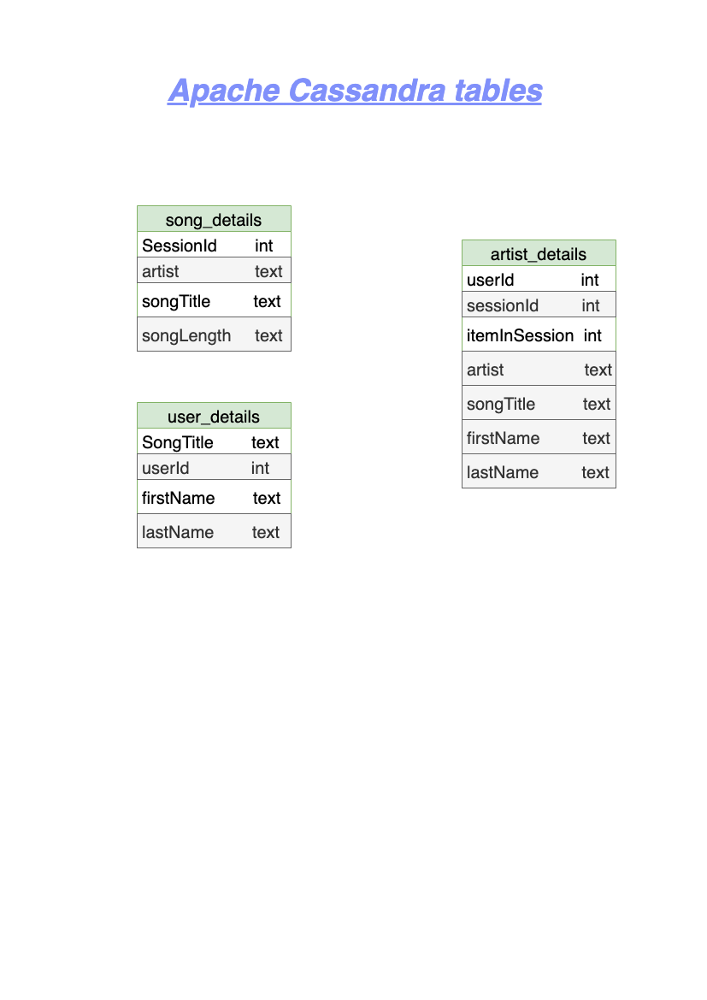

<br />
<p align="center">
  
 <h3 align="center">Data Modeling ETL with Apache Cassandra</h3>
 <p align="center">
  Udacity Nanodegree Project 2
  <br />
 </p>
</p>

## About The Project

A startup called Sparkify wants to analyze the data they've been collecting on songs and user activity on their new music streaming application. The analytics team is particularly interested in understanding what songs users are listening to. Currently, they don't have an easy way to query their data, which resides in a directory of JSON logs on user activity on the application, as well as a directory with JSON meta-data on the songs in their application.

They'd like a data engineer to create a Apache Cassandra database which can create queries on song play data to answer the questions and make meaningful insights. The role of this project is to create a database schema and ETL pipeline for this analysis.

### Project Description

In this project, we will model the data with Apache Cassandra and build an ETL pipeline using Python. The ETL pipeline transfers data from a set of CSV files within a directory to create a streamlined CSV file to model and insert data into Apache Cassandra tables. We will create separate denormalized tables for answering specific queries, properly using partition keys and clustering columns.

### Used Technologies

* python(including pandas, psycopg2, os, glob  libraries)
* Apache Cassandra 
* Jupyter Notebook

### Data
- **Event Dataset**: Event dataset is a collection of CSV files containing the information of user activity across a period of time. Each file in the dataset contains the information regarding the song played, user information and other attributes .

List of available data columns :

```
artist, auth, firstName, gender, itemInSession, lastName, length, level, location, method, page, registration, sessionId, song, status, ts, userId
```

### KeySpace Schema



For this project each table is modeled to answer a specific known query. This model enables to query the database schema containing huge amounts of data. Relational databases are not suitable in this case due to the masses of data.

### How to run the Python scripts:

#### Prerequisites
- Python installed
- cassandra installed 
- psycopg2 and pandas libraries

#### How to run
1. Navigate to `Project 1 Data Modeling with PostgreSQL`
2. Run `Project2.ipynb` to create `event_datafile_new.csv`, then to initiate the ETL process and load data into tables, and finally to check whether the data has been loeaded into database by executing specefic queries.


### Contact

* **Yahia FERCHOULI** /  
y.ferchouli@outlook.fr
[LinkedIn](https://www.linkedin.com/in/yahia-ferchouli-95a15b188)
