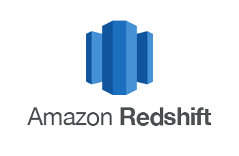
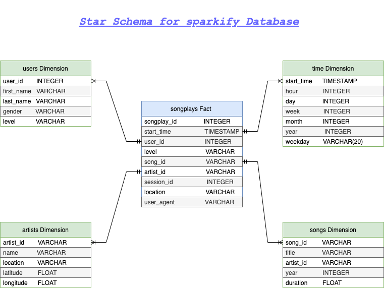

<br />
<p align="center">
  
 <h3 align="center">Data Warehousing with Redshift</h3>
 <p align="center">
  Udacity Nanodegree Project 3
  <br />
 </p>
</p>

## About The Project

A startup called Sparkify wants to analyze the data they've been collecting on songs and user activity on their new music streaming application. Sparkify has grown their user base and song database and want to move their processes and data onto the cloud. Their data resides in S3, in a directory of JSON logs on user activity on the application, as well as a directory with JSON metadata on the songs in their application.

They'd like a data engineer to build an ETL pipeline that extracts their data from S3, stages them in Redshift, and transforms data into a set of dimensional tables for their analytics team to continue finding insights in what songs their users are listening to. The role of this project is to create a data warehouse on cloud (AWS Redshift) and build ETL pipeline for this analysis

### Project Description

In this project, we will build a data warehouse on AWS and build an ETL pipeline for a database hosted on Redshift. The data is loaded from S3 buckets to staging tables on Redshift and modeled into fact and dimensions tables to perform analytics and obtain meaningful insights.

### Used Technologies

* python
* AWS
* Jupyter Notebook

### Data
- **Song Dataset**: Songs dataset is a subset of [Million Song Dataset](http://millionsongdataset.com/). Each file in the dataset is in JSON format and contains meta-data about a song and the artist of that song. The dataset is hosted at S3 bucket `s3://udacity-dend/song_data`.

A sample of a single row of each files is:

```
{"num_songs": 1, "artist_id": "ARJIE2Y1187B994AB7", "artist_latitude": null, "artist_longitude": null, "artist_location": "", "artist_name": "Line Renaud", "song_id": "SOUPIRU12A6D4FA1E1", "title": "Der Kleine Dompfaff", "duration": 152.92036, "year": 0}
```

#### Log Dataset

Logs dataset is generated by [Event Simulator](https://github.com/Interana/eventsim). These log files in JSON format simulate activity logs from a music streaming application based on specified configurations. The dataset is hosted at S3 bucket `s3://udacity-dend/log_data`.

A sample of a single row of each files is:

```
{"artist": null, "auth": "Logged In", "firstName": "Walter", "gender": "M", "itemInSession": 0, "lastName": "Frye", "length": null, "level": "free", "location": "San Francisco-Oakland-Hayward, CA", "method": "GET","page": "Home", "registration": 1540919166796.0, "sessionId": 38, "song": null, "status": 200, "ts": 1541105830796, "userAgent": "\"Mozilla\/5.0 (Macintosh; Intel Mac OS X 10_9_4) AppleWebKit\/537.36 (KHTML, like Gecko) Chrome\/36.0.1985.143 Safari\/537.36\"", "userId": "39"}
```
### Database Schema



For this project we used a Star Schema with one main Fact table containing all the measures associated to each event(user actions), and 4 Dimensions tables, each one with a primary Key that is being referenced from the Fact table.

#### Why using a Star Schema Model ?

- Making queries easier with simple JOINS.
- The amount of data to analyze is not big enough to require a big data solution or using NoSQL Databases.
#### Prerequisites
- Python 3.7 or higher installed
- PostgreSQL installed 
- psycopg2, boto3 libraries
- AWS account (creating IAM User and IAM Role)

#### How to run
1. Navigate to `Project 1 Data Modeling with PostgreSQL`
2. Add AWS accesss Key and Secret Key in `dwh.cfg` file
3. Execute the cels in `create_cluster.ipynb` until the step 4, after the step 2.2 get the `DWH_ENDPOINT` and place it in HOST field in `dwh.cfg` file. do the same thing and place `DWH_ENDPOINT` in `ARN` field in `dwh.cfg` file
4. Run `create_tables.py` to create or drop tables by executing this command

   ```python
   python create_tables.py
   ```
5. Run `etl.py` (ETL process) and load data into database by executing this command

   ```python
   python etl.py
   ```
   This will extract and copy  data from an S3 source into the staging area on Redshift, transform and load this data into the Postgres tables on Redshift.
6. Run `test.py` to test if the data are loaded into tables
7. Run step 5 in `create_cluster.ipynb` file to clean up the AWS resources


### Contact

* **Yahia FERCHOULI** /  
y.ferchouli@outlook.fr
[LinkedIn](https://www.linkedin.com/in/yahia-ferchouli-95a15b188)
